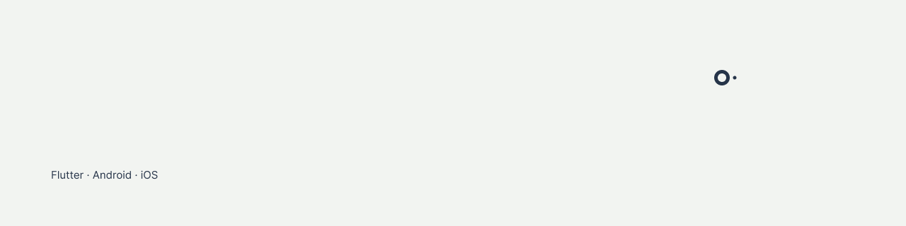

I write mobile apps for iOS and Android. Flutter for 2.3 years, then native Android for 2 years on three retail e-commerce apps, plus Swift for macOS.
Below are the ones I build on my own time.

- Healpen: journaling based on expressive writing. Flutter, Hive, Firebase. [TestFlight beta](https://testflight.apple.com/join/qBYPPDhN).
- Peakward: running coach with adaptive plans. Flutter, HealthKit, Postgres. [TestFlight beta](https://testflight.apple.com/join/vg7K8ZA5).
- Noima: spaced-repetition flashcards. Flutter, Supabase, FSRS. In development, [noima.app](https://noima.app).
- Mighty: Logitech mouse utility for macOS. Swift 6, IOKit/HID++. [On Homebrew](https://mighty.mikezamayias.com).
- famon: Firebase Analytics CLI for Android and iOS logs. Dart. [v1.5.1 on pub.dev](https://pub.dev/packages/famon).
- zam_ui: Flutter design system with OKLCH tokens. Dart. BSD-3.

Notes on what I build are at [mikezamayias.com](https://mikezamayias.com). Also on [LinkedIn](https://linkedin.com/in/mikezamayias).
